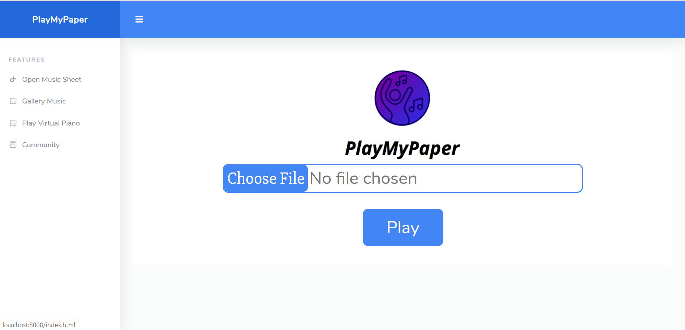
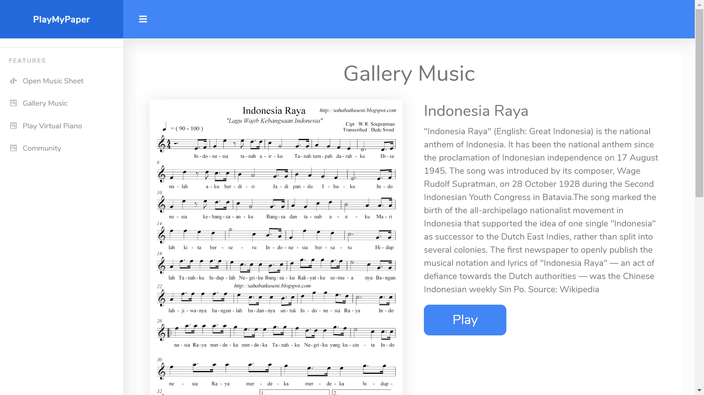
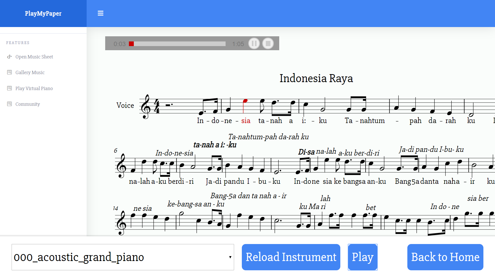
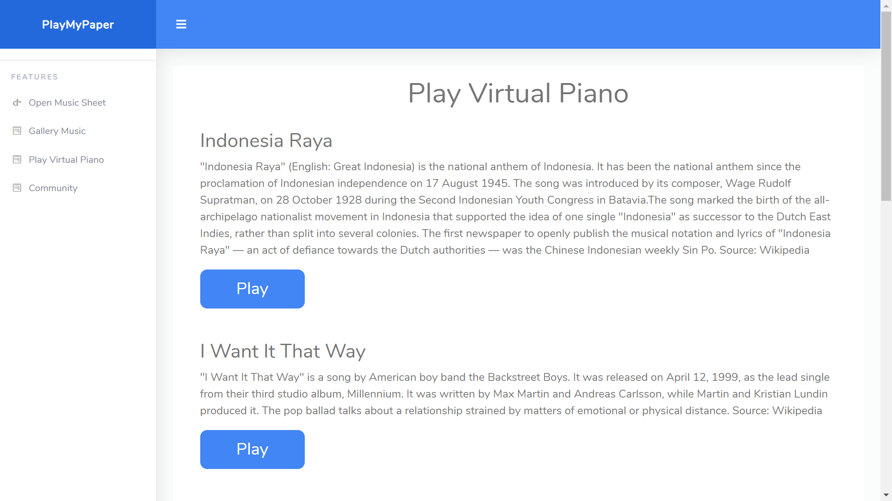
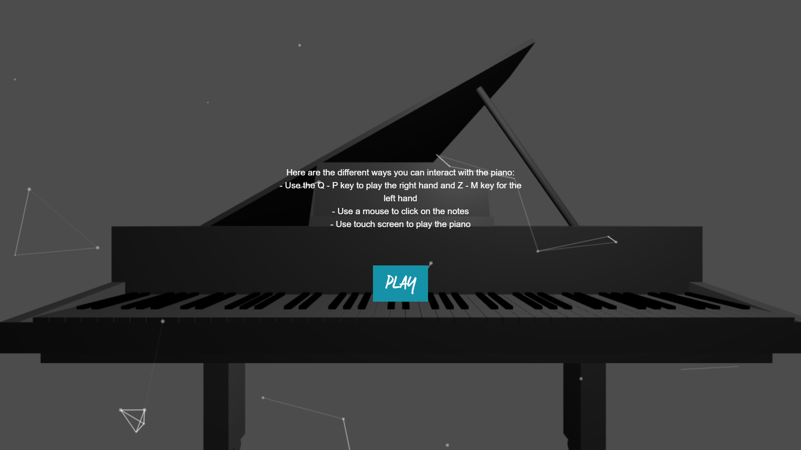
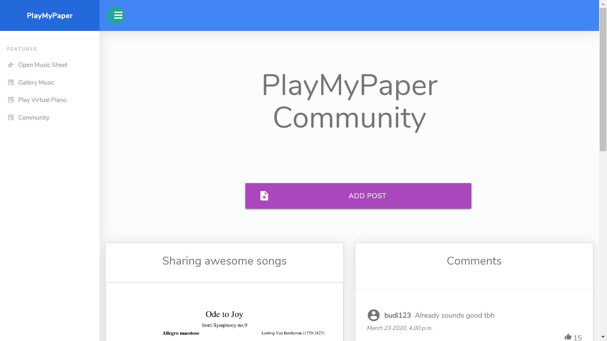

# Developer Student Clubs [DSC] Solution Challenge 2020

## PlayMyPaper
Music can be fairly difficult to learn and make, with the ability to create music having a relatively high learning curve. 
Our platform provides: 
- A feature for people to play music sheets without the need for an actual instrument to manually play the notes to have a basic understanding of how the music is being played out. 
- Virtual Piano Simulation that plays music so that it helps people to learn and understand music from the real animation. People are also able to play simultaneously with the system.
- Last but not least, a community platform for people who interested in music to discuss and share their awesome ideas to fellow friends.

## Features
#### Open Music Sheet and play the instrument

#### Gallery Music 
_To play instrument from the music sheet_

#### Play Virtual Piano
_See the virtual piano plays the music then learn musics in fun way and easy_

#### Community

## How to install

    git clone https://github.com/Audiveris/audiveris
    # put inside audiveris folder
    
    Run `composer install`
    
    Run `php artisan key:generate`
    
    Run `php artisan serve`
    
    Run `localhost:8000`

## YouTube Link

## Thank You! Have a nice day!!
